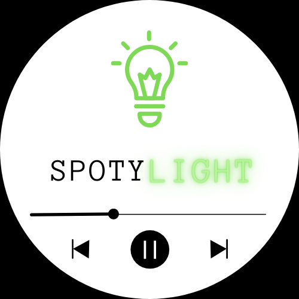
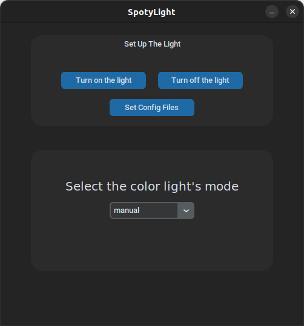
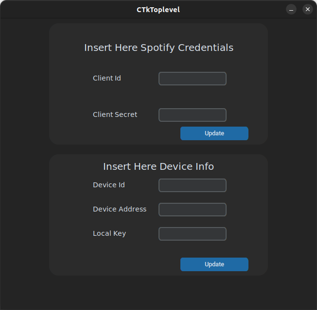

# spotyLight
<p align="center">
  
</p>

## 🎵 Bored of change your smart light's color every time a song on spotify changes to keep up the mood? 🎵

#### Don't worry I got you something you might like!

<br>

# Features :


<h2>📍 Changes the color of your smart Light (for now it only works with tuyaLights)</h2>
<p align="center">
    
</p>


# Python
First install all the dependencies needed typing : 
```python
pip install -r requirements.txt
```


# Make it works :

# 1)
###  Create two files in the current directory :
- one named spotyCreds.json and paste in it those lines:
  ```json
  {"clientId":"","clientSecret":""}
  ```
- one named deviceInfo.json and paste in it those lines:
  ``` json
  {"deviceId":"","deviceAddress":"","localKey":""}
  ```
# 2) 
### Then you have to sign in to [Spotify Developers page](https://developer.spotify.com/), go at the [dashboard page](https://developer.spotify.com/dashboard/applications) a create a new application. 
### Once you have created it edit the setting by writing "https://github.com/geth0/spotyLight" in the Redirect URIs field.
# 3)
### Click on your new application and copy the Client Id and paste it in the spotyCreds.json file inside the quotes. 
### Do the same thing for the Client Secret. Your spotyCreds.json file should look like this:
```json
{
    "clientId": "xxxxxxxxxxxxxxxxxxxxxxxxxxxxxxxx",
    "clientSecret": "xxxxxxxxxxxxxxxxxxxxxxxxxxxxxxxx"
}
``` 
# 4)
### Now you have to go on [Tuya Developers page](https://auth.tuya.com/?from=https%3A%2F%2Fdeveloper.tuya.com%3Fredirect%3Dhttps%3A%2F%2Fiot.tuya.com) (create an account if you haven't one yet).
### Now follow a [tutorial](https://www.youtube.com/watch?v=Q1ZShFJDvE0) to get the local key of your smartLight
### Once you have your localKey paste it in your deviceInfo.json file. Then make sure you have installed the dependencies and run this code in the terminal :
```python
python3 -m tinytuya scan
``` 
or 
```python
python -m tinytuya scan
``` 
### Copy the device address and the device id from the output and paste them in the deviceInfo.json file. It now should look like this: 
```json
{
    "deviceId": "xxxxxxxxxxxxxxxxxxxxxx",
    "deviceAddress": "xxx.xxx.x.xx",
    "localKey": "xxxxxxxxxxxxxxxx"
}
```
# 5)
### Ok now you can simply run the main.py file : 
```python
python main.py
``` 
or 
```python
python3 main.py
``` 
# 6) *OPTIONAL*
### If you want to have a nice gui for controll the light and change the modality of it simply run:
```python
python3 tkGui.py
```
or
```python
python tkGui.py
```
<p align="center">

  

  
</p>

# Credentials : 
### When successfully running on your machine it'll open up your default browser.
### You have to login with your spotify account and accept the terms.
### Then it'll redirect you to another page; You simply have to copy all the url of the new page and paste it in the terminal.
### 🎵 Enjoy your music with a dynamic light! 💡
# Found an Issue?
## Report it by create a [new issue](https://github.com/gEth0/notion-school/issues/new)

# New features and improvements coming soon!
### gEth0 💯 
